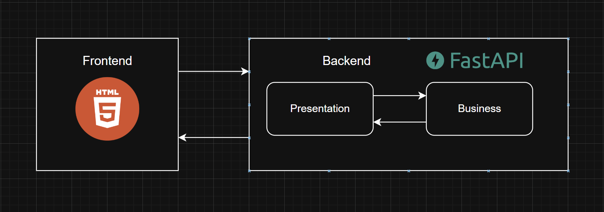
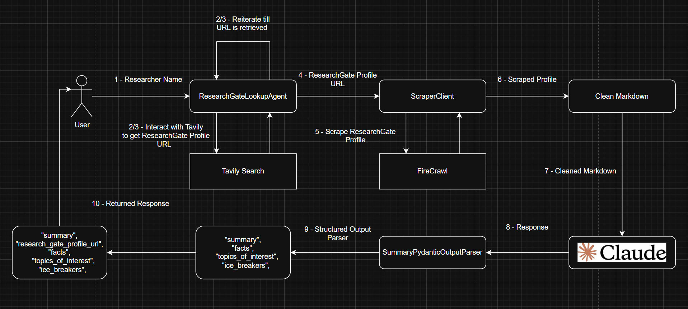

# Researcher Ice Breaker

A LangChain agent that, given a healthcare professional's ResearchGate profile, searches ResearchGate to find academic
profiles, conference participation, and publications.  
The agent will generate personalized icebreakers tailored to their research, initiatives, or affiliations.

# Architecture

## System Architecture



## Ice Breaker Architecture



# Getting Started

## Prerequisites

- Python must be installed on local device. You can install it from
  the [Python installation guide](https://www.python.org/downloads/).
- uv must be installed, as it is used here as the dependency manager. You can install it from
  the [uv installation guide](https://docs.astral.sh/uv/getting-started/installation/).

## Environment Variables

| Variable                | Description                                                                          |
|-------------------------|--------------------------------------------------------------------------------------|
| `APP_NAME`              | The name of the application.                                                         |
| `APP_VERSION`           | The version of the application.                                                      |
| `APP_PORT`              | Port on which the application will run.                                              |
| `ENVIRONMENT`           | Application environment (Options: development, staging, production).                 |
| `MODEL_ID`              | The model ID for LLM (e.g., Claude 3).                                               |
| `MODEL_TEMPERATURE`     | Temperature setting for the model (0.0 - 1.0).                                       |
| `LANGSMITH_TRACING`     | The LangSmith tracing setting.                                                       |
| `LANGSMITH_TRACING_V2`  | LangSmith v2 tracing option.                                                         |
| `LANGSMITH_ENDPOINT`    | LangSmith API endpoint.                                                              |
| `LANGSMITH_API_KEY`     | The API key for LangSmith integration.                                               |
| `LANGSMITH_PROJECT`     | The LangSmith project name.                                                          |
| `FIRECRAWL_API_KEY`     | The API key for Firecrawl integration.                                               |
| `TAVILY_API_KEY`        | The API key for Tavily integration.                                                  |
| `AWS_ACCESS_KEY_ID`     | AWS access key for other integrations.                                               |
| `AWS_SECRET_ACCESS_KEY` | AWS secret access key for other integrations.                                        |
| `AWS_REGION`            | AWS region for the service.                                                          |
| `CORS_ORIGINS`          | List of allowed CORS origins (e.g., `["http://localhost","http://localhost:8000"]`). |

## Setup

1. **Clone the repository**
    - cd into ice-breaker:
      ``` 
      cd backend

2. **Create `.env` File:**
    - Create a `.env` file inside the `./app` directory, where it contains source code.
    - Add the following content to the `.env` file based on `.env.template`:
3. **Setup virtual environment for the project**
    - Run in terminal:
      ``` 
      uv sync
      uv lock
    - After running commands this should create a .venv folder if not:
      ``` 
      uv venv
    - Choose the local python interpreter by selecting the current virtual environment in the used IDE.
    - Choose existing not generating new one, and select the following `.venv\Scripts\python.exe`.
4. **Run Project**
    - After setting up virtual environment enter the `./app` directory and run the main function in the `main.py`.

# APIs

| Endpoint                       | Method | Summary              | Description                                                                                 |
|--------------------------------|--------|----------------------|---------------------------------------------------------------------------------------------|
| `/`                            | GET    | Read Index           | Returns a the index.html file for testing the ice-breaker.                                  |
| `/api/v1/healthy`              | GET    | Health Check         | Checks the health of the API to ensure it's running.                                        |
| `/api/v1/ice-breaker/generate` | POST   | Generate Ice Breaker | Accepts a `name` and generates personalized ice breakers based on the ResearchGate profile. |

# Deployment

## Deploying with Docker (Manual)

To manually deploy the `Researcher Ice Breaker` application using Docker, follow these steps:

1. **Build the Docker image**:
    ```bash
    docker build -t ice-breaker:${APP_VERSION} .
    ```

2. **Run the Docker container**:
    ```bash
    docker run -d -p ${APP_PORT}:${APP_PORT} --env-file .env ice-breaker:${APP_VERSION}
    ```

    - This will run the container in detached mode (`-d`) and map the container’s port to the specified `APP_PORT`.
    - Make sure to replace `${APP_PORT}` with the actual port you want to run the application on (e.g., `8000`).

3. **Check running container**:
    ```bash
    docker ps
    ```

   This will show all running containers. Your container should be listed.

4. **Access the application**:
   Once the container is running, open your browser and go to `http://localhost:${APP_PORT}` to interact with the API.

---

## Deploying with Docker Compose

If you prefer to use Docker Compose, follow these steps:

1. **Create a `docker-compose.yml` file**:
    ```yaml
    name: langchain-course

    services:
      ice-breaker:
        container_name: ice-breaker
        build:
          context: .  # Path to the directory with the Dockerfile
          dockerfile: ./Dockerfile
        ports:
          - "${APP_PORT}:${APP_PORT}"  # Ensure APP_PORT is defined in your .env
        env_file:
          - .env
    ```

2. **Start the application with Docker Compose**:
    ```bash
    docker-compose up --build -d
    ```

    - This will build the image (if necessary) and start the container in detached mode (`-d`).

3. **Check running container**:
    ```bash
    docker-compose ps
    ```

   This will show all services managed by Docker Compose. You should see the `ice-breaker` service listed.

4. **Access the application**:
   Once the container is running, open your browser and go to `http://localhost:${APP_PORT}` to interact with the API.

5. **Stopping the application**:
    ```bash
    docker-compose down
    ```

   This will stop and remove the container along with any associated networks.

---

### Additional Notes

- **Environment Variables**: Make sure you have the `.env` file properly configured with all the necessary environment
  variables (as described earlier in the README).
- **Application Logs**: To view the logs of the running container, you can use:
    ```bash
    docker logs ice-breaker
    ```

---

By following these steps, you can deploy and run the `Researcher Ice Breaker` application using Docker or Docker Compose
easily.


